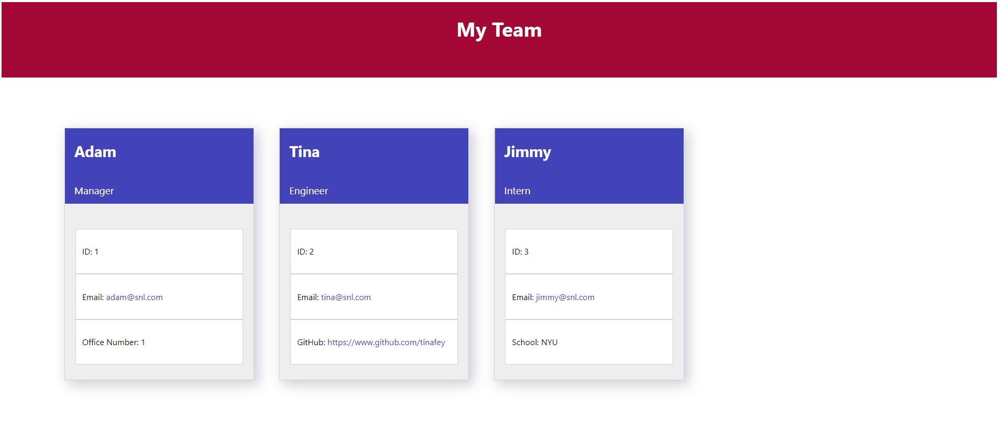

# Team Profile Generator

## Task

For this project, I was tasked to build a Node.js command-line application from scratch.  The application was to take in user-submitted information about employees on a software engineering team and then generate an HTML webpage that displays a summary for each team member.

The assignment also included instructions as to write tests for the code.

## User Story

```md
AS A manager
I WANT to generate a webpage that displays my team's basic info
SO THAT I have quick access to their emails and GitHub profiles
```

## Acceptance Criteria

```md
GIVEN a command-line application that accepts user input
WHEN I am prompted for my team members and their information
THEN an HTML file is generated that displays a nicely formatted team roster based on user input
WHEN I click on an email address in the HTML
THEN my default email program opens and populates the TO field of the email with the address
WHEN I click on the GitHub username
THEN that GitHub profile opens in a new tab
WHEN I start the application
THEN I am prompted to enter the team manager’s name, employee ID, email address, and office number
WHEN I enter the team manager’s name, employee ID, email address, and office number
THEN I am presented with a menu with the option to add an engineer or an intern or to finish building my team
WHEN I select the engineer option
THEN I am prompted to enter the engineer’s name, ID, email, and GitHub username, and I am taken back to the menu
WHEN I select the intern option
THEN I am prompted to enter the intern’s name, ID, email, and school, and I am taken back to the menu
WHEN I decide to finish building my team
THEN I exit the application, and the HTML is generated
```

## Other Requirements

The first class is an `Employee` parent class with the following properties and methods:

* `name`

* `id`

* `email`

* `getName()`

* `getId()`

* `getEmail()`

* `getRole()`&mdash;returns `'Employee'`

The other three classes will extend `Employee`.

In addition to `Employee`'s properties and methods, `Manager` will also have the following:

* `officeNumber`

* `getRole()`&mdash;overridden to return `'Manager'`

In addition to `Employee`'s properties and methods, `Engineer` will also have the following:

* `github`&mdash;GitHub username

* `getGithub()`

* `getRole()`&mdash;overridden to return `'Engineer'`

In addition to `Employee`'s properties and methods, `Intern` will also have the following:

* `school`

* `getSchool()`

* `getRole()`&mdash;overridden to return `'Intern'`

## Screenshot


## URLs
### Repository
https://github.com/barrygilreath3/team_profile_generator

### Contact
barrygilreath3@gmail.com